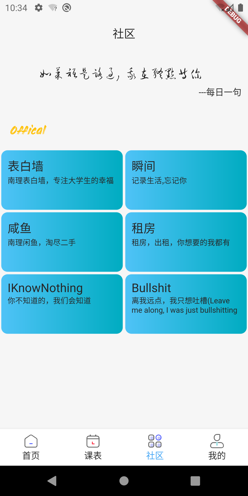
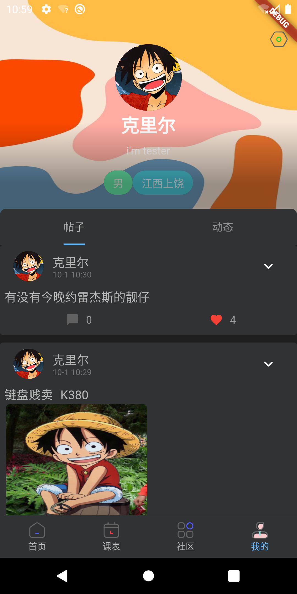
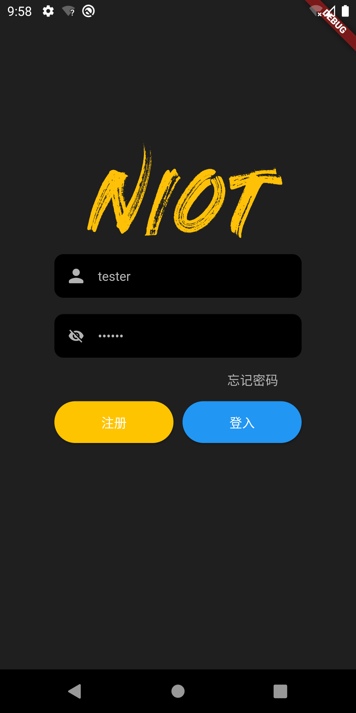

## 学在南理移动端(Android|Ios)

### 使用flutter的原因
就目前移动端开发体验来说, android原生(java/kotlin)拥有比较精准的控制(比如手势操作, 内存管理), 但学习时间周期长, React Native(JavaScript)使用js桥接
进行跨端, 目前最成熟的跨端框架, 但限制太多, 需对IOS和Android同时了解, 且不是真正意义上的跨端, 就我写的课程表体验来看, flutter是目前bug最少, 且对手势有足够使用且简单
的封装, 又同时兼顾原生手势支持, 三者我都写过个把月, 个人认为, 目前flutter是最适合后端开发人员进行快速开发界面的框架, 且dart集成了c的全局变量域, 类java的Class, package管理, JavaScript的单线程异步
(async/await)模型, 类Promise Api, 如对三种语言都有一定熟悉, 可快速上手. ps.目前急缺美工

### 开发学在南理的起因
刚来学校时,表白墙还是刚做,帮帮也是,要关注一堆公众号,麻烦不用我说了,加上后来表白墙开始不合理收费,接收信息不及时等一系列我认为作为一个公众平台不该有的样子,于是自从我转入计算机系便开始了这个计划,于是在我准备一年之久,他诞生了,我期望让一些事物应该有他本来的样子...

### 进度

- [x] 用户管理
- [x] 课程表(添加,删除,更改学期,上传云端)
- [x] 发帖,评论,点赞

### todo

- 继续完善帖子部分细节
- 增加用户自定义板块
- 用户安全
- 课程表背景以及部分细节
- 主页增加视频流
- flutter中的WebView键盘Bug处理
- 主页banner细化
- 主题
- 多语言

### 部分截图

    
    
    
    
    

